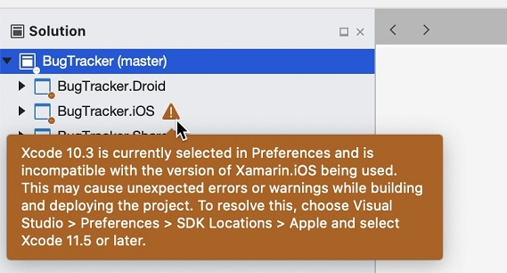

# Get Started on Visual Studio 2022 For Mac

While it is easier to create apps using Uno Platform on Windows, you can also create all but UWP/WinUI apps on your Mac.

## Prerequisites
* [**Visual Studio 2022 for Mac Preview**](https://visualstudio.microsoft.com/vs/mac/preview/)
* [**Xcode**](https://apps.apple.com/us/app/xcode/id497799835?mt=12) 14.1 or higher
* An [**Apple ID**](https://support.apple.com/en-us/HT204316)
* [**GTK+3**](https://formulae.brew.sh/formula/gtk+3) for running the Skia/GTK projects

[!include[getting-help](use-uno-check-inline-macos.md)]

## Installing the dotnet new templates
In order to create a new Uno Project, you'll need to install the [`dotnet new` Uno Platform templates](get-started-dotnet-new.md).

## Create a new project using the IDE
1. To create a new project, from the command line, where `src` is your own development folder.
    ```
    cd src
    dotnet new unoapp -o MyApp01
    ```

1. Once created, open the `MyApp-vsmac.slnf` file
    * This `slnf` is called a solution filter, which automatically excludes projects which are not compatible with Visual Studio 2022 for Mac.
    * If you have a warning symbol on your iOS project, make sure you have the minimum version of Xcode installed.
\

To update, go to `Visual Studio > Preferences > Projects > SDK Locations > Apple` and select Xcode 13.3 or higher.
Restart Visual Studio.
1. You can now run on iOS, Android, macOS, and Skia.GTK projects by changing your startup project and starting the debugger.

> [!NOTE]
> You will not be able to build the UWP and WPF projects on a Mac. All changes to this project must be made on Windows.

> [!IMPORTANT]
> As of .NET 6 Mobile RC3, the macOS head can fail to build with issues related to the AOT compiler. You can run the Catalyst app on a mac.

## Create other projects types using the command line

You can create a new Uno Platform solution with the following terminal command:
    ```bash
    dotnet new unoapp -o MyProject --wasm=false
    ```

Once created, you can open it using Visual Studio 2022 for Mac.

### Build and Run for WebAssembly

Building for WebAssembly takes a few more steps:

1. Set `MyProject.Wasm` to startup project
1. Build the project
1. In the terminal, navigate to your build output path. This will typically be: `MyProject.Wasm > bin > Debug > net7.0 > dist`
1. Install `dotnet serve`:
    ```
    dotnet tool install -g dotnet-serve
    ```
1. Once installed type `dotnet serve` (or `~/.dotnet/tools/dotnet-serve`).
1. Navigate to the URL presented by the tool to run your application

[!include[getting-help](getting-help.md)]
