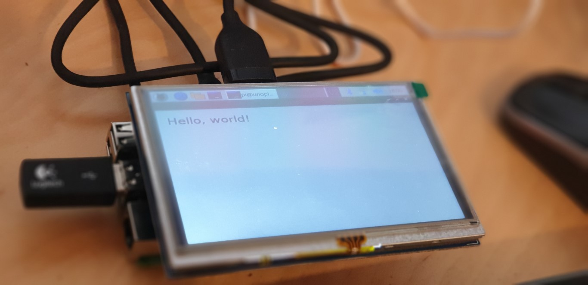
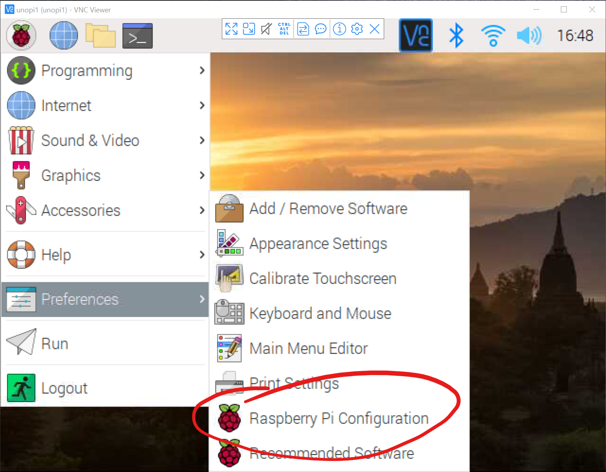
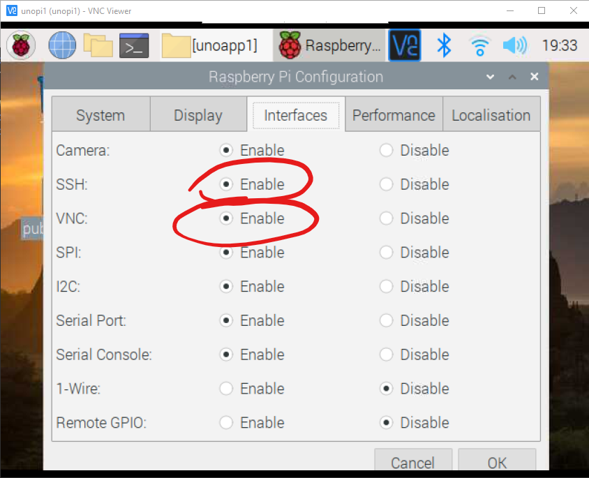
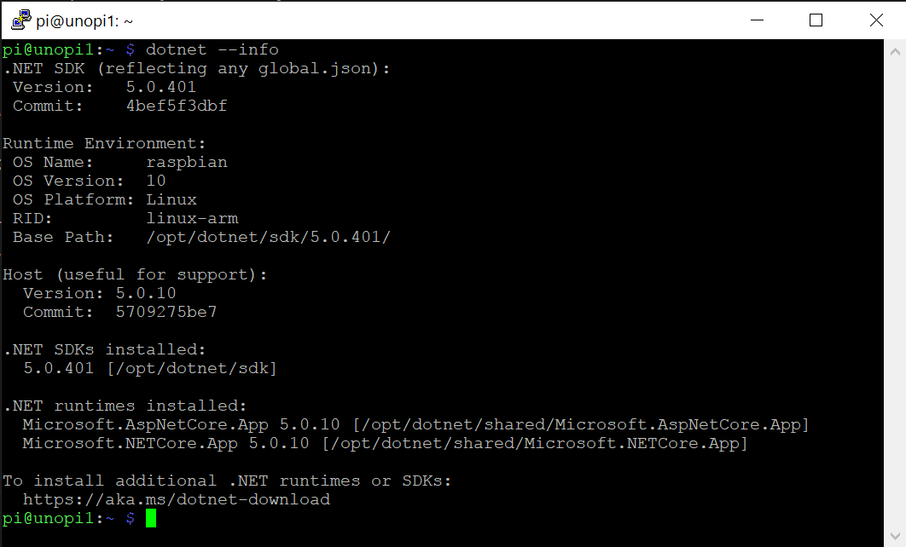
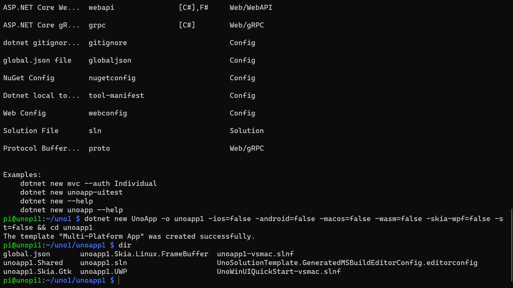
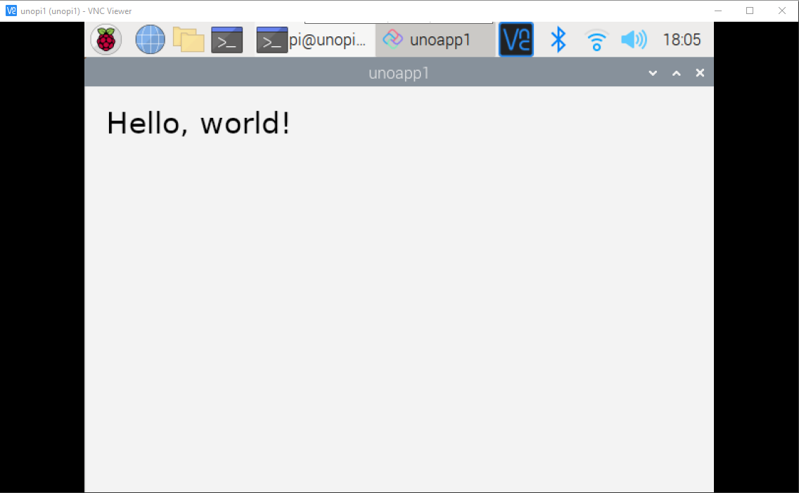

# Getting Started with Uno Platform and the Raspberry Pi



## Prerequisites

For this guide, you'll need various pieces of hardware and an Azure Account;

- Raspberry Pi 3b+ and above (I'll be using a [4Gb Pi 4](https://shop.pimoroni.com/products/raspberry-pi-4?variant=29157087445075))
- [Raspberry Pi Power Supply](https://shop.pimoroni.com/products/universal-usb-c-power-supply-5-1v-3a)
- [16GB SD Card](https://amzn.to/2YAI07e)
- SSH Client like [PuTTY](https://putty.org/)(Both Windows and Mac have a built in ssh client)
- Code Editor - [Visual Studio Code](https://code.visualstudio.com)
- Choose the two following options:
  - [LCD Touchscreen](https://amzn.to/3uYSXvt), Keyboard and mouse
  - OR [VNC Viewer](https://www.realvnc.com/en/connect/download/viewer/)

## What we'll be doing

In this guide, we'll be setting up our Raspberry Pi to launch a "Hello World" Uno Application.

For this guide, we'll install all of the requirements to build and run the application directly on the Pi, but I will show you how to do this on your main machine at the end.

There will be a series of steps involved in this;

1. [Connect to your Raspberry Pi](#connect-to-your-raspberry-pi)
2. [Update Raspberry Pi OS](#update-raspberry-pi-os)
3. [Install .NET Framework](#install-dot-net-framework)
4. [Install Uno Platform Templates](#install-uno-platform-templates)
5. [Create a new Uno Solution](#create-a-new-uno-solution)
6. [Give the SSH Session access to use the display](#give-the-ssh-session-access-to-use-the-display)
7. [Build and run the application](#build-and-run-the-application)
8. [Creating and Building on a PC](#creating-and-building-on-a-pc)
9. [Wrap Up](#wrap-up)

## Connect to your Raspberry Pi

Before we go anywhere, let's make sure we can dial in to our Raspberry Pi.

You may need to do this part with a Keyboard, a Mouse and Monitor of course, unless you enabled SSH on the SD card before you installed Raspberry Pi OS.

Firstly, make sure that your Pi is connected to the same network.

We need to enable both SSH and VNC connections, so click the Raspberry Pi OS start button, then go to the Preferences sub menu and hit the "Raspberry Pi Configuration Item";



Next, click the Interfaces Tab, and make sure that SSH and VNC are enabled;



Hit the Ok button, and accept the offer to reboot your Pi.

## Update Raspberry Pi OS

Before we can do anything, assuming you've gotten your Raspberry Pi all set up, we need to make sure that everything is up to date.

Run the following two commands;

```
sudo apt update
sudo apt full-upgrade
```

Once those two commands have completed, restart your Pi using;

`sudo reboot`

## Install Dot NET Framework

Now that our Pi is all up to date, we're ready to install the .NET Framework.

Normally for the Pi, as there's no `apt-get install dotnet`, we'd need to go through a bunch of steps to get .NET Framework installed.

However, I've created a single line install script for .NET 5 on the Raspberry Pi.

Run the following command;

`wget -O - https://raw.githubusercontent.com/pjgpetecodes/dotnet5pi/master/install.sh | sudo bash`

You can see the contents of this script [here](scripts/install.sh)


Once the process has completed, go ahead and reboot your Pi again with;

`sudo reboot`

Once you're finished, you should be able to run the following to check your .NET framework version;

`dotnet --info`



## Install Uno Platform Templates

Next we can add the Uno Platform Project Templates to our .NET Installation;

`dotnet new --install Uno.ProjectTemplates.Dotnet`


Once the templates are installed, you can scroll back up and see the list of Uno templates that were installed;


## Create a new Uno Solution

Now we have the moving parts installed on our Pi, we can spin up a brand new Uno solution with the following command;

`dotnet new UnoApp -o unoapp1 -ios=false -android=false -macos=false -wasm=false -skia-wpf=false -skia-tizen=false && cd unoapp1`

You should now find yourself in the solution directory for your new Uno App. If we have a look at the folder contents with;

`dir`



In the solution we've just created we have several files, including a global.json file which enforces that we use at least .NET Core 3.1.100.

We also have the main solution files that we can open in Visual Studio on Windows or Mac.

Then we have four directories;

| Directory | Purpose |
| :--- | :--- |
| `unoapp1` | Contains the main XAML page  |
| `unoapp1.Skia.Gtk` | Contains the Linux / Raspberry Pi Version |
| `unoapp1.Skia.Linux.FrameBuffer` | Provides Access to a Window Manager and the Cursor  |
| `unoapp1.UWP` | Contains the Windows UWP version |

The directory we're interested in is the `unoapp1.Skia.Gtk` directory. This directory contains the project which we'll build and run on the Raspberry Pi.

It actually includes the build outputs from the `unoapp1` and `unoapp1.Skia.Linux.FrameBuffer` projects too, and in the next tutorial, we'll dive into those in a bit more detail.

## Give the SSH Session access to use the display

Before we can launch our application, we need to give our SSH session access to the display.

If we don't do this, we'll get an error like;

```
Unable to init server: Could not connect: Connection refused

(unoapp1.Skia.Gtk:18530): Gtk-WARNING **: 19:40:51.384: cannot open display:
```

We can sort this out using the following command;

`export DISPLAY=:0`

You won't get any response to this message, so don't worry.

You'll need to remember do this every time you launch a new SSH session currently, but don't worry too much about that for now.

## Build and run the application

We're now ready to run our application.

Firstly, we need to navigate to the Skia.Gtk directory;

`cd unoapp1.Skia.Gtk`

We can now run our application with;

`dotnet run`

This will take quite some time to run this command the first time as the Pi isn't as powerful as a desktop PC of course.

You may also see some errors, but don't worry about those, as they're complaining that we're not running this from Visual Studio for XAML Hot reload to connect to.

To be able to see your app running, you're going to need to either connect a Monitor or VNC, but all being well, after a minute or so, you should see the Uno Hello World application running happily on your Pi;



## Creating and Building on a PC

We've performed most of this on the Pi itself of course. However, you can actually create and build the whole application on your PC and copy the built files to your Pi using;

`dotnet publish -r linux-arm -o bin\linux-arm\publish --no-self-contained`

You can copy the contents of the `bin\linux-arm\publish` directory to your Pi in whatever way takes your fancy.

You then need to navigate to the directory where you've copied the files and make the main application executable with;

`chmod +x unoapp1.Skia.Gtk`

Don't forget that, if you've just dialled in you'll need to give access to the Display;

`export DISPLAY=:0`

If you are using a 64-bit version of the Raspberry Pi OS, you need to run the following commands to be able to run 32-bit executable :
`$ sudo apt-get install ia32-libs-multiarch`
`$ sudo apt-get install ia32-libs`

You can then run the application with;

`./unoapp1.Skia.Gtk`

I've created a blog post around how you can actually automate Building, Deploying and even debugging from your Windows machine using VS Code;

[Developing UWP Apps for the Raspberry Pi with Uno Platform](https://www.petecodes.co.uk/developing-uwp-apps-for-the-raspberry-pi-with-uno-platform/)

## Wrap Up

With that, we've gotten our first Hello World application up and running on the Raspberry Pi.

Thanks.

[Pete Gallagher](https://www.twitter.com/pete_codes)
