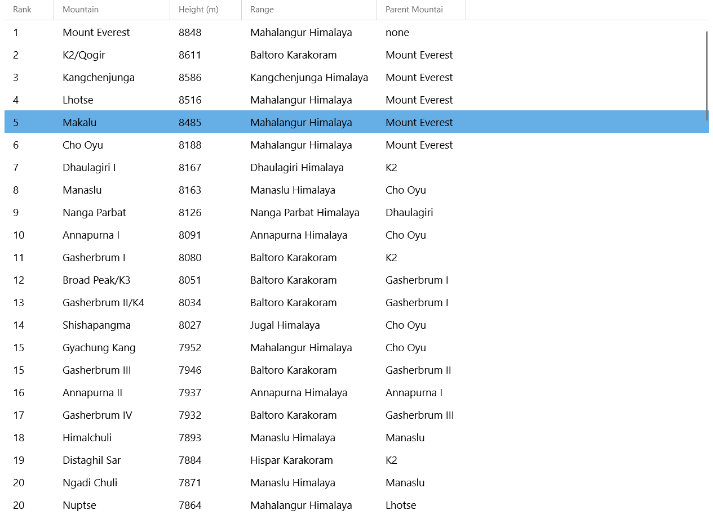

# How to use Windows Community Toolkit

The [Windows Community Toolkit](https://docs.microsoft.com/en-us/windows/communitytoolkit/) is a collection of helper functions, custom controls, and app services. It simplifies and demonstrates common developer patterns when building experiences for Windows 10.

This tutorial will walk through adding and implementing the DataGrid control but the steps can be followed for any of the Uno ported Windows Community Toolkit controls.

> [!TIP]
> The complete source code that goes along with this guide is available in the [unoplatform/Uno.Samples](https://github.com/unoplatform/Uno.Samples) GitHub repository - [Uno Windows Community Toolkit Sample](https://github.com/unoplatform/Uno.Samples/tree/master/UI/UnoWCTDataGridSample)

> [!Tip]
> For a step-by-step guide to installing the prerequisites for your preferred IDE and environment, consult the [Get Started guide](get-started.md).

## NuGet Packages for Uno Platform

Uno has ported the Windows Community Toolkit for use in Uno applications to allow for use on Windows,
Android, iOS, macOS, mac Catalyst, Linux, and WebAssembly.

The following packages are available:

# [WinUI / WinAppSDK](#tab/tabid-winui)
- [Uno.CommunityToolkit.WinUI](https://www.nuget.org/packages/Uno.CommunityToolkit.WinUI)
- [Uno.CommunityToolkit.WinUI.Connectivity](https://www.nuget.org/packages/Uno.CommunityToolkit.WinUI.Connectivity)
- [Uno.CommunityToolkit.WinUI.DeveloperTools](https://www.nuget.org/packages/Uno.CommunityToolkit.WinUI.DeveloperTools)
- [Uno.CommunityToolkit.WinUI.UI](https://www.nuget.org/packages/Uno.CommunityToolkit.WinUI.UI)
- [Uno.CommunityToolkit.WinUI.UI.Animations](https://www.nuget.org/packages/Uno.CommunityToolkit.WinUI.UI.Animations)
- [Uno.CommunityToolkit.WinUI.UI.Behaviors](https://www.nuget.org/packages/Uno.CommunityToolkit.WinUI.UI.Behaviors)
- [Uno.CommunityToolkit.WinUI.UI.Controls](https://www.nuget.org/packages/Uno.CommunityToolkit.WinUI.UI.Controls)
- [Uno.CommunityToolkit.WinUI.UI.Controls.Core](https://www.nuget.org/packages/Uno.CommunityToolkit.WinUI.UI.Controls.Core)
- [Uno.CommunityToolkit.WinUI.UI.Controls.DataGrid](https://www.nuget.org/packages/Uno.CommunityToolkit.WinUI.UI.Controls.DataGrid)
- [Uno.CommunityToolkit.WinUI.UI.Controls.Input](https://www.nuget.org/packages/Uno.CommunityToolkit.WinUI.UI.Controls.Input)
- [Uno.CommunityToolkit.WinUI.UI.Controls.Layout](https://www.nuget.org/packages/Uno.CommunityToolkit.WinUI.UI.Controls.Layout)
- [Uno.CommunityToolkit.WinUI.UI.Controls.Markdown](https://www.nuget.org/packages/Uno.CommunityToolkit.WinUI.UI.Controls.Markdown)
- [Uno.CommunityToolkit.WinUI.UI.Controls.Media](https://www.nuget.org/packages/Uno.CommunityToolkit.WinUI.UI.Controls.Media)
- [Uno.CommunityToolkit.WinUI.UI.Controls.Primitives](https://www.nuget.org/packages/Uno.CommunityToolkit.WinUI.UI.Controls.Primitives)
- [Uno.CommunityToolkit.WinUI.UI.Media](https://www.nuget.org/packages/Uno.CommunityToolkit.WinUI.UI.Media)

These package ids are for Uno Platform (non-Windows) projects. For WinUI 3 projects, you should use the equivalent packages published by Microsoft (`CommunityToolkit.WinUI`, `CommunityToolkit.WinUI.UI.Controls` etc).

# [UWP](#tab/tabid-uwp)

- [Uno.Microsoft.Toolkit](https://www.nuget.org/packages/Uno.Microsoft.Toolkit )
- [Uno.Microsoft.Toolkit.Parsers](https://www.nuget.org/packages/Uno.Microsoft.Toolkit.Parsers)
- [Uno.Microsoft.Toolkit.Services](https://www.nuget.org/packages/Uno.Microsoft.Toolkit.Services)
- [Uno.Microsoft.Toolkit.UWP](https://www.nuget.org/packages/Uno.Microsoft.Toolkit.UWP)
- [Uno.Microsoft.Toolkit.Uwp.Notifications](https://www.nuget.org/packages/Uno.Microsoft.Toolkit.Uwp.Notifications)
- [Uno.Microsoft.Toolkit.Uwp.Services](https://www.nuget.org/packages/Uno.Microsoft.Toolkit.Uwp.Services)
- [Uno.Microsoft.Toolkit.Uwp.UI.Controls.DataGrid](https://www.nuget.org/packages/Uno.Microsoft.Toolkit.UWP.UI.DataGrid)
- [Uno.Microsoft.Toolkit.Uwp.UI](https://www.nuget.org/packages/Uno.Microsoft.Toolkit.UWP.UI)
- [Uno.Microsoft.Toolkit.Uwp.UI.Animations](https://www.nuget.org/packages/Uno.Microsoft.Toolkit.Uwp.UI.Animations)
- [Uno.Microsoft.Toolkit.Uwp.UI.Controls](https://www.nuget.org/packages/Uno.Microsoft.Toolkit.Uwp.UI.Controls)
- [Uno.Microsoft.Toolkit.Uwp.UI.Controls.Graph](https://www.nuget.org/packages/Uno.Microsoft.Toolkit.UWP.UI.Controls.Graph)
- [Uno.Microsoft.Toolkit.Uwp.Connectivity](https://www.nuget.org/packages/Uno.Microsoft.Toolkit.Uwp.Connectivity)

These package ids are for Uno (non-Windows) projects. For UWP project, you should use the equivalent packages published by Microsoft (`Microsoft.Toolkit`, `Microsoft.Toolkit.Parsers` etc).

***

## Task 1 - Add Windows Community Toolkit to Uno Projects
  
  
1. Install Nuget package for targeted control  
   

> [!NOTE]
> For UWP and WinUI 3 projects, you should use the packages published by Microsoft that are **not** prefixed with `Uno.*`.


2. Add a reference to the UWP UI Controls

# [WinUI / WinAppSDK](#tab/tabid-winui)

   In XAML:  
    ```xmlns:controls="using:CommunityToolkit.WinUI.UI.Controls"```  
  
   In C#:  
    ```using CommunityToolkit.WinUI.UI.Controls;```

# [UWP](#tab/tabid-uwp)

   In XAML:  
    ```xmlns:controls="using:Microsoft.Toolkit.Uwp.UI.Controls"```  
  
   In C#:  
    ```using Microsoft.Toolkit.Uwp;```

***

## Task 2 - Add the DataGrid Control

This control will create an easily organized grid that will allow you to create flexible columns and rows.

1. Begin by adding the control using the syntax below. Change the `x:Name` to the name of your DataGrid.  
```<controls:DataGrid x:Name="dataGrid"></controls:DataGrid>```

2. Add columns. Similar to how you would configure columns for a XAML `Grid` layout, you can add column definitions within your `DataGrid` control:

    ```xml
    <controls:DataGrid.Columns>
        <controls:DataGridTextColumn Header="Rank"/>
        <controls:DataGridComboBoxColumn Header="Mountain"/>
    </controls:DataGrid.Columns>
    ```

    This will create two columns that can be adjusted by the user.
    

    Alternatively, you can use the `AutoGenerateColumns` attribute on your `DataGrid` control if you do not know how many columns your data will require.  

    ``` xml
    <controls:DataGrid x:Name="dataGrid" AutoGenerateColumns="True" />
    ```

3. Format your rows in the same way as your columns or use a `DataTemplate` added as an attribute on the `DataGrid` control:

    ``` xml
    <controls:DataGrid x:Name="dataGrid" RowDetailsTemplate="{StaticResource RowDetailsTemplate}">
    ```

4. Data can be added with data binding. First, add your `ItemsSource` as a property of your `DataGrid` control.  

    ``` xml
    <controls:DataGrid x:Name="dataGrid" ItemsSource="{x:Bind MyViewModel.Customers}" />  
    ```

    Then, set the binding on each column:

    ``` xml
    <controls:DataGrid.Columns>
        <controls:DataGridTextColumn Header="Rank" Binding="{Binding Rank}" Tag="Rank" />
        <controls:DataGridTextColumn Header="Mountain" Binding="{Binding Mountain}" Tag="Mountain" />
    </controls:DataGrid.Columns>
    ```  

## Referencing the Windows Community Toolkit from a Cross-Targeted Library

The Uno Platform build of the Windows Community toolkit is not needed when running on WinAppSDK or UWP, which is why you'll need to make some small changes to the project.

Adding the Uno version of the community toolkit to a Uno Platform cross-targeted library can cause build errors like this one:

```
Controls\TextBox\Themes\Generic.xaml : Xaml Internal Error error WMC9999: 
Type universe cannot resolve assembly: Uno.UI, Version=255.255.255.255, 
Culture=neutral, PublicKeyToken=null.
```

To fix this, instead of adding the Uno version of the toolkit like the code below.

# [WinUI / WinAppSDK](#tab/tabid-winui)

Replace:
```xml
<ItemGroup>
  <PackageReference Include="Uno.CommunityToolkit.WinUI.UI.Controls" Version="7.1.100" />
</ItemGroup>
```

With a conditional reference:

```xml
<ItemGroup Condition="$([MSBuild]::GetTargetPlatformIdentifier('$(TargetFramework)')) == 'windows'">
  <PackageReference Include="CommunityToolkit.WinUI.UI.Controls" Version="7.1.2" />
</ItemGroup>
<ItemGroup Condition="$([MSBuild]::GetTargetPlatformIdentifier('$(TargetFramework)')) != 'windows'">
  <PackageReference Include="Uno.CommunityToolkit.WinUI.UI.Controls" Version="7.1.100" />
</ItemGroup>
```

# [UWP](#tab/tabid-uwp)

Replace:

```xml
<ItemGroup>
  <PackageReference Include="Uno.Microsoft.Toolkit.Uwp.UI.Controls" Version="7.0.0" />
</ItemGroup>
```

Add a conditional reference:

```xml
<ItemGroup Condition="'$(TargetFramework)' == 'uap10.0.19041'">
  <PackageReference Include="Microsoft.Toolkit.Uwp.UI.Controls" Version="7.0.0" />
</ItemGroup>
<ItemGroup Condition="'$(TargetFramework)' != 'uap10.0.19041'">
  <PackageReference Include="Uno.Microsoft.Toolkit.Uwp.UI.Controls" Version="7.0.0" />
</ItemGroup>
```

You may need to replace `uap10.0.19041` with the version defined in the `TargetFrameworks` node at the top of the csproj file.

***

## See a working example with data



A working sample complete with data is available on GitHub: [Uno Windows Community Toolkit Sample](https://github.com/unoplatform/Uno.Samples/tree/master/UI/UnoWCTDataGridSample)

<br>

***

[!include[getting-help](getting-help.md)]
